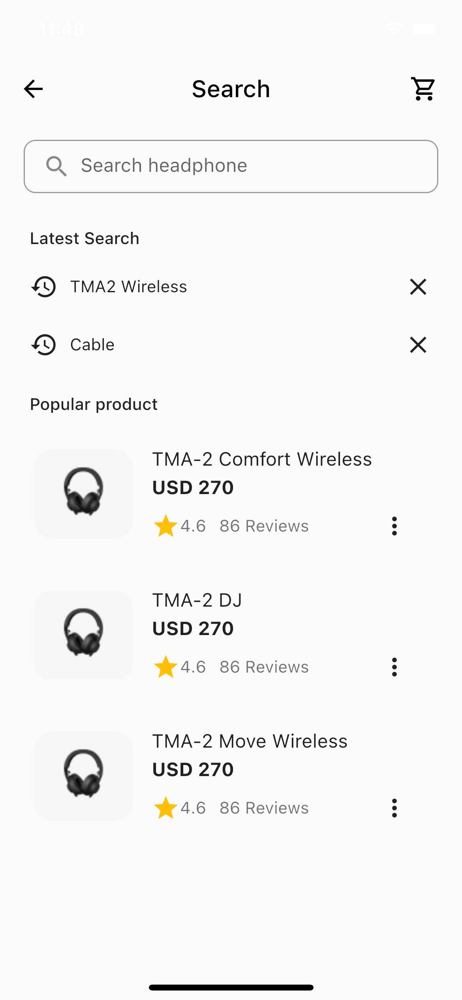

# E-commerce UI Example with Flutter

Flutter representation of a E-commerce App Concept that I found on Figma.

This is an basic UI example and there is no any business logic in codes.
You are free to develop that application with backend.

## Requirements

* Any Operating System (ie. MacOS X, Linux, Windows)
* Any IDE with Flutter SDK installed (ie. IntelliJ, Android Studio, VSCode etc)
* A little knowledge of Dart and Flutter

## ScreenShots

## TODO

* All pages will be added
* Code refactoring with atomic approach

## Thanks

E-Commerce UI Kit V1.1. it's free.
Figma link: <https://www.figma.com/community/file/900960330469075490>
